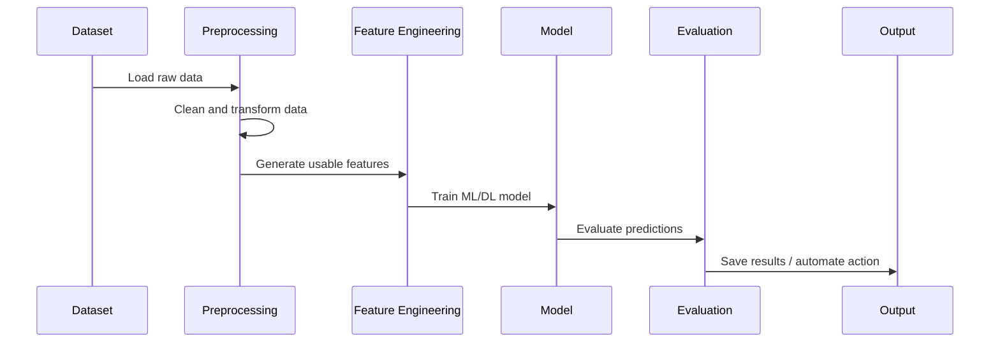
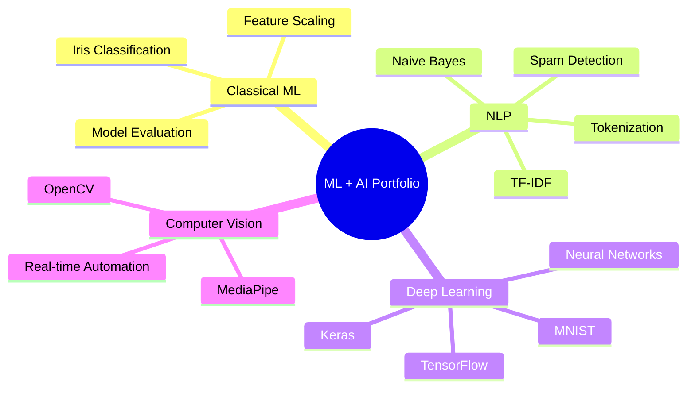

<div align="center">


<br/>


<br/>
<br/>


<br/>


</div>

---

<br/>

<div align="center">

## 🤖 Portfolio Overview


</div>

<br/>

Welcome to my **Machine Learning & AI Projects Portfolio**.

This repository contains a curated collection of hands-on projects across **classical supervised learning, natural language processing, deep learning, computer vision, and real-time automation**.

The goal of this repository is to demonstrate practical understanding of the full ML workflow:


<br/>

---

<br/>

<div align="center">

## 🚀 Projects at a Glance

</div>

<br/>

|  # | Project                           | Domain          | Core Skills                              |
| -: | --------------------------------- | --------------- | ---------------------------------------- |
|  1 | **Iris Flower Classification**    | Classical ML    | EDA, feature scaling, classification     |
|  2 | **Spam Email Detection**          | NLP             | Tokenization, TF-IDF, Naive Bayes        |
|  3 | **Handwritten Digit Recognition** | Deep Learning   | Neural networks, MNIST, TensorFlow/Keras |
|  4 | **Gesture-Based Volume Control**  | Computer Vision | OpenCV, MediaPipe, real-time automation  |

<br/>

---

<br/>

<div align="center">

## 🧠 Featured Projects


</div>

<br/>

<table>
<tr>
<td width="50%" valign="top">

## 🌸 1. Iris Flower Classification

**Domain:** Classical Machine Learning
**Tech Stack:** Python, Scikit-learn, Pandas, Matplotlib

A foundational machine learning project using the classic **Iris dataset** to classify flower species based on sepal and petal measurements.

### Key Focus

* Exploratory Data Analysis
* Data visualization
* Feature scaling
* Multi-class classification
* Model training and evaluation

<br/>

<a href="./Iris-Flower-Classification">
  
</a>

</td>

<td width="50%" valign="top">


</td>
</tr>
</table>

<br/>

---

<br/>

<table>
<tr>
<td width="50%" valign="top">


</td>

<td width="50%" valign="top">

## 📩 2. Spam Email Detection

**Domain:** Natural Language Processing
**Tech Stack:** Python, NLTK, Scikit-learn, Naive Bayes

A binary classification model designed to identify fraudulent or spam emails using text preprocessing and machine learning techniques.

### Key Focus

* Text preprocessing
* Tokenization
* Stopword removal
* TF-IDF vectorization
* Naive Bayes classification
* Precision, recall, and accuracy evaluation

<br/>

<a href="./Spam-Email-Detection">
  
</a>

</td>
</tr>
</table>

<br/>

---

<br/>

<table>
<tr>
<td width="50%" valign="top">

## 🔢 3. Handwritten Digit Recognition

**Domain:** Deep Learning
**Tech Stack:** TensorFlow, Keras, MNIST, Neural Networks

A deep learning project that recognizes handwritten digits from **0 to 9** using the MNIST dataset.

### Key Focus

* Neural network architecture
* Dense layers and activation functions
* Loss functions and optimizers
* Training and validation workflow
* Digit classification performance

### Dataset Note

The original MNIST dataset is large, so the project may use a compressed dataset or a data-loading script.

<br/>

<a href="./Handwritten-Digit-Recognition">
  
</a>

</td>

<td width="50%" valign="top">


</td>
</tr>
</table>

<br/>

---

<br/>

<table>
<tr>
<td width="50%" valign="top">


</td>

<td width="50%" valign="top">

## 🖐️ 4. Gesture-Based Volume Control

**Domain:** Computer Vision + Automation
**Tech Stack:** OpenCV, MediaPipe, PyAutoGUI

A real-time computer vision application that allows users to control system volume using hand gestures through a webcam.

### Key Focus

* Real-time image processing
* Hand landmark detection
* Gesture tracking
* Distance-based volume control
* Hardware/system automation

<br/>

<a href="./Gesture-Based-Volume-Control">
  
</a>

</td>
</tr>
</table>

<br/>

---

<br/>

<div align="center">

## 🛠️ Skills Demonstrated

</div>

<br/>

<table>
<tr>
<td width="33%" valign="top">

### 📊 Data Science


</td>

<td width="33%" valign="top">

### 🤖 Machine Learning


</td>

<td width="33%" valign="top">

### 🧠 AI + Vision


</td>
</tr>
</table>

<br/>

---

<br/>

<div align="center">

## 🧪 Model Development Workflow

</div>

<br/>



<br/>

---

<br/>

<div align="center">

## 🚀 Getting Started

</div>

<br/>

### 1. Clone the Repository

```bash id="mddnj9"
git clone https://github.com/dhrumilrana25/Machine-Learning-Projects.git
cd Machine-Learning-Projects
```

### 2. Create a Virtual Environment

```bash id="7tr2d1"
python -m venv venv
```

### 3. Activate the Environment

#### Windows

```bash id="4kn4z8"
venv\Scripts\activate
```

#### macOS / Linux

```bash id="a8kizb"
source venv/bin/activate
```

### 4. Install Dependencies

```bash id="3694zd"
pip install -r requirements.txt
```

### 5. Open Jupyter Notebook

```bash id="i78lgv"
jupyter notebook
```

<br/>

---

<br/>

<div align="center">

## 📁 Suggested Repository Structure

</div>

<br/>

```txt id="z0q3lb"
Machine-Learning-Projects/
│
├── Iris-Flower-Classification/
│   ├── iris_classification.ipynb
│   ├── dataset/
│   └── README.md
│
├── Spam-Email-Detection/
│   ├── spam_detection.ipynb
│   ├── dataset/
│   └── README.md
│
├── Handwritten-Digit-Recognition/
│   ├── mnist_digit_recognition.ipynb
│   ├── dataset/
│   └── README.md
│
├── Gesture-Based-Volume-Control/
│   ├── gesture_volume_control.py
│   └── README.md
│
├── requirements.txt
└── README.md
```

<br/>

---

<br/>

<div align="center">

## 📈 Learning Path Represented

</div>

<br/>



<br/>

---

<br/>

<div align="center">

## 🔮 Future Goals


</div>

<br/>

* Build more projects around **Large Language Models**
* Explore **Retrieval-Augmented Generation**
* Add **Reinforcement Learning** experiments
* Improve projects with **MLOps-style structure**
* Add experiment tracking and model versioning
* Deploy selected projects with Streamlit or FastAPI

<br/>

---

<br/>

<div align="center">

## 📬 Connect

<br/>

[](https://www.linkedin.com/in/dhrumil-rana-265316232/)
[](mailto:dhrumilrana25@gmail.com)
[](https://github.com/dhrumilrana25)

<br/>
<br/>

### “Learning by building — from models to real-world intelligent systems.”

<br/>


</div>
